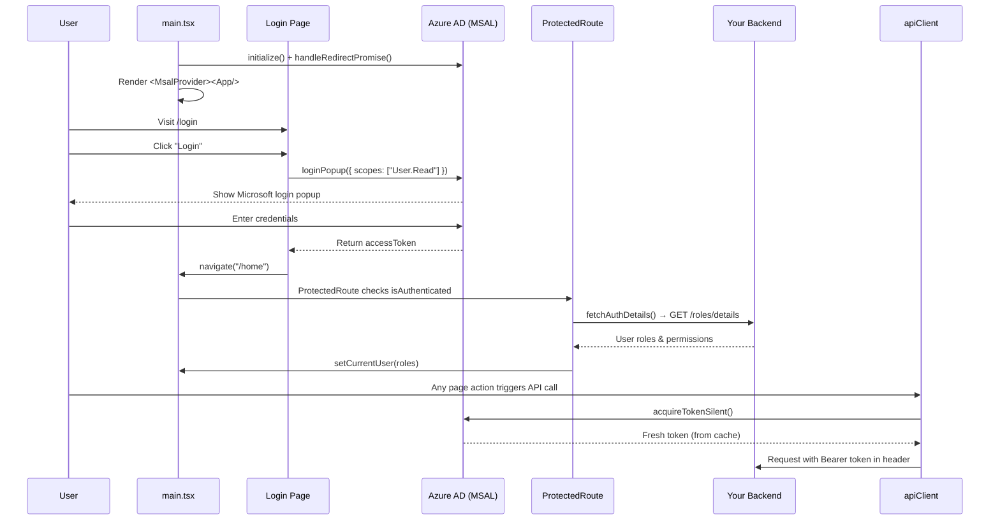

# Authentication Flow — HVDC KG Frontend

This app uses **Microsoft Azure AD (Entra ID)** authentication via the **MSAL (Microsoft Authentication Library)** library — essentially "Login with Microsoft" for enterprise apps.

---

## Key Files

| File | Purpose |
|---|---|
| `src/Utils/authConfig.ts` | Azure AD app registration settings |
| `src/main.tsx` | MSAL init, wraps app in `MsalProvider` |
| `src/pages/Login/Login.tsx` | Login UI, triggers `loginPopup` |
| `src/Utils/protectedRoute.tsx` | Guards routes, fetches user roles |
| `src/Utils/authService.ts` | `getToken()` for silent token refresh |
| `src/services/apiClient.ts` | Attaches Bearer token to every API call |
| `src/Utils/UserRoleHelper.ts` | Role/permission check functions |
| `src/context/UserContext.tsx` | Global state for logged-in user |

---

## Step-by-Step Flow

### Step 1 — App Configuration (`src/Utils/authConfig.ts`)

This is where you tell MSAL **who your app is** and **what permissions it needs**.

```ts
msalConfig = {
  auth: {
    clientId:    "bc115335-..."  // Your app's unique ID registered in Azure AD
    authority:   "https://login.microsoftonline.com/<tenantId>/"  // Your company's Microsoft directory
    redirectUri: VITE_CALLBACK_URL  // Where Microsoft sends the user back after login
  },
  cache: {
    cacheLocation: "sessionStorage"  // Tokens stored in browser session storage
  }
}

loginRequest = {
  scopes: ["User.Read"]  // Ask permission to read the logged-in user's basic profile
}
```

Think of `clientId` + `authority` as your app's "ID card" with Azure.

---

### Step 2 — MSAL Initialization (`src/main.tsx`)

This runs **once when the app starts**, before anything renders.

```
msalInstance = new PublicClientApplication(msalConfig)
  ↓
msalInstance.initialize()
  ↓
handleRedirectPromise()  →  picks up any login redirect response
  ↓
getAllAccounts()  →  if user was already logged in, set them as active
  ↓
addEventCallback()  →  listen for LOGIN_SUCCESS / ACQUIRE_TOKEN_SUCCESS events
  ↓
Render <App /> wrapped in <MsalProvider instance={msalInstance}>
```

`MsalProvider` makes the MSAL instance available to **every component** in the app via React Context.

---

### Step 3 — Login Page (`src/pages/Login/Login.tsx`)

When a user visits `/login`:

```
1. useIsAuthenticated() checks if already logged in
   → If YES → redirect to /home immediately (via useEffect)

2. User clicks "Login" button
   → handleLogin() runs
   → instance.loginPopup(loginRequest)
      → Opens a Microsoft popup window
      → User enters their Microsoft/company credentials
      → Microsoft returns an accessToken
   → If accessToken received → navigate("/home")
```

> `loginPopup` opens a **popup window** for login. An alternative is `loginRedirect` (full-page redirect) — this app uses popup.

---

### Step 4 — Route Protection (`src/Utils/protectedRoute.tsx`)

Every page except `/login` is wrapped in `<ProtectedRoute>`. This acts as a **security gate**:

```
ProtectedRoute checks:
  ├── inProgress !== "none"  →  MSAL still working  →  show "Loading..."
  ├── isAuthenticated = false  →  redirect to /login
  └── isAuthenticated = true  →  allow access to the page
        ↓
      useEffect runs:
        → fetchAuthDetails()  →  calls backend GET /roles/details
        → setCurrentUser(response.data)  →  stores user + roles in global context
        → Checks specific routes:
            /SettingsDashboard  →  must have hasSettingsAccess()   or redirect to /home
            /ChangeRequest      →  must have UPDATE_CHANGES permission  or redirect to /home
```

---

### Step 5 — Token on Every API Call (`src/services/apiClient.ts`)

Every time a backend API is called, MSAL **silently** fetches a fresh token and attaches it:

```
Request Interceptor (runs before every API call):
  → AuthService.getToken()
      → msalInstance.acquireTokenSilent({ account, scopes })
         → If token in cache & not expired  →  return it (no popup needed)
         → If expired  →  try to refresh silently in background
         → If refresh fails  →  logout() user
  → config.headers.Authorization = `Bearer <token>`
  → API call proceeds with token in header
```

This same pattern applies to both:
- **`apiClient`** — calls to your own backend
- **`graphMicrosoftClient`** — calls to the Microsoft Graph API (e.g. user search)

---

### Step 6 — User Roles & Permissions (`src/Utils/UserRoleHelper.ts`)

After login, the app fetches the user's **roles from the backend**. These roles control what they can see and do:

```
ROLES:
  SUPER_ADMIN        →  full access to everything
  DEVELOPER_ADMIN    →  full access to everything
  PROJECT_ADMIN      →  manage specific projects
  DEVELOPER          →  create/update projects
  REVIEWER           →  review changes
  USER               →  read-only access

PERMISSIONS:
  USER_MANAGEMENT    →  manage users in Settings
  VIEW_PROJECT       →  view projects
  CREATE_PROJECT     →  create new projects
  UPDATE_PROJECT     →  edit project details
  CREATE_CHANGES     →  raise change requests
  UPDATE_CHANGES     →  approve/reject change requests

Key helper functions:
  hasAllAccess(user)                          →  SUPER_ADMIN or DEVELOPER_ADMIN?
  hasSettingsAccess(user)                     →  can access Settings page?
  hasAccess(user, PERMISSIONS.UPDATE_CHANGES) →  can approve change requests?
  hasProjectCreateAccess(user)                →  can create new projects?
  filterSettingsProjects(user, projects)      →  filter projects visible to user in Settings
```

---

### Step 7 — Global User State (`src/context/UserContext.tsx`)

After roles are fetched, they're stored in **React Context** so any component can access them:

```
UserProvider holds:
  currentUser              →  logged-in user's profile + roles
  disciplines              →  fetched automatically when currentUser is set
  submittedChangeRequests  →  workflow tracking

Any component can read:
  const { currentUser } = useUserContext();
```

When `currentUser` is set, the context automatically fetches the discipline list from the backend.

---

## Full Sequence Diagram



---

## Token Lifecycle

```
Login (loginPopup)
  → accessToken stored in sessionStorage by MSAL
  → Valid for ~1 hour

Any API call
  → acquireTokenSilent() checks cache first
  → If expired, MSAL uses refresh token to get a new one silently
  → If refresh fails (e.g. session expired) → AuthService.logout() is called
     → logoutRedirect() → user sent back to login page
```

---

## Environment Variables Required

| Variable | Description |
|---|---|
| `VITE_CALLBACK_URL` | Redirect URI after login/logout (must match Azure AD app registration) |
| `VITE_API_URL` | Base URL for your backend API |
| `VITE_GRAPH_MICROSOFT_API_URL` | Microsoft Graph API base URL |
| `VITE_APP_ENV` | Environment name (`prod`, `dev`) — disables console logs in production |
